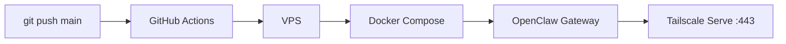

# The AI Council
Building a layer of AI-Agents that communicate in an A2A manner and get things done for me or on my behalf. 

## Goal
The goal is to build two simple things - 
1. **one ai-manager** - who is managing the council, this manager is the poc between me and the council, I will talk to the council via this manager. the goal of the manager is that the right ai agent is chosen to do a particular task, to ensure and update me when the task is done, and teach the ai agents things if I dont like a particular output. 
2. **a council of ai employees** - each employee knows very well how to do a particular task, it has a personality, memory, etc.

## Deployed Agents
| Agent Name | Responsibility |
|----------|----------|
| Sunday   | She is my first ai agent, responsible to manage my calendars   |

## Deployment

Each agent runs in a Docker container on the VPS, deployed automatically via GitHub Actions on every push to `main`. The OpenClaw gateway is exposed through **Tailscale Serve** — no ports open to the public internet.

Tailscale uses **WireGuard encryption** — all traffic is end-to-end encrypted. The service is only accessible to devices inside my private tailnet. No public IP binding, no SSH tunnel, no firewall holes. Even with the IP, a connection is impossible without tailnet authentication. Access is further restricted via **ACLs** — only approved devices and users can reach the gateway.
